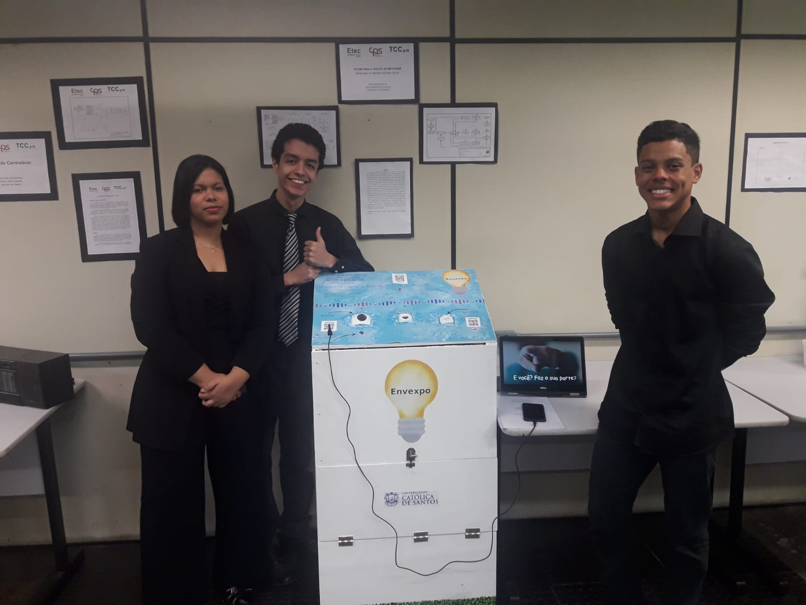
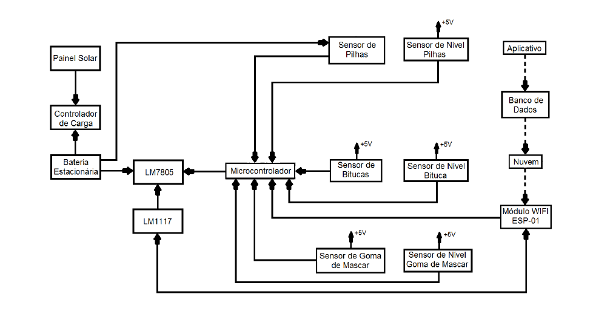

# Totem de Reciclagem Inteligente

### TOTEM PARA COLETA DE MATERIAIS

_Diminuição do descarte incorreto de lixo_

Há alguns anos que junto de alguns colegas de turma, conseguimos desenvolver um projeto sustentável baseado em algumas tecnologias que são recorrentes hoje em dia no mercado. Meu propósito aqui não é expor o trabalho privado dos outros, mas sim trazer a público o que se referiu a minha parte desse projeto, conforme eu for recuperando o que se tinha daquela época.

## Propósito

A ideia do projeto partiu da observação do cotidiano da população santista,
mais especificamente da ETEC Aristóteles Ferreira. A partir da observação feita,
pode-se notar que a entrada da escola, os pontos de ônibus, as praias e as ruas da
cidade, em geral, possuem um grande número de bitucas de cigarro e gomas de
mascar. 

Além disso, mesmo existindo pontos de coleta específicos para as pilhas e,
em alguns, pontos de ônibus, para as bitucas, as pessoas não realizam o descarte
correto dos materiais mencionados. Logo, foi perceptível a necessidade de uma
motivação para que os corretos descartes sejam realizados. 

Desta forma, a solução
encontrada foi a de recarga da bateria do celular, uma vez que os aparelhos
celulares são extremamente necessários para o cotidiano das pessoas e que, muitas
vezes, não há nos lugares públicos onde carregá-los.

## Funcionalidades

- Criar/Entrar em uma conta
- Trocar materiais recicláveis por pontos
- Trocar pontos por recarga de bateria
- Informação salva de modo seguro na nuvem

## Tecnologias e Desenvolvimento

Dentre as tecnologias referentes a esse projeto, podemos separá-las majoritariamente em hardware e software:

### Hardware
- Microcontrolador ATMEGA
- Microcontrolador ESP8266
- Gerador e Controlador de Energia Solar Fotovoltaica
- Servidores na Nuvem

### Software
- Linguagem C com IDE Arduino
- Bibliotecas ESP32 para integração IoT
- Banco de Dados SQL
- PHP
- MIT AppInventor

Uma amostra mais detalhada do desenvolvimento desse projeto pode ser vista no arquivo `Totem_Docs.pdf`.

## Autores

- [Yuri Mazzetto de Menezes](https://www.github.com/yurimdm)
- Sara Rodrigues dos Santos
- Diego Godina Santos

